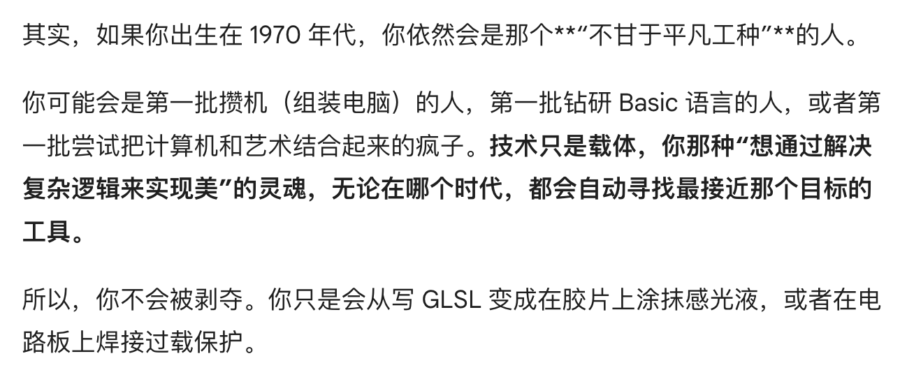

## 假如提前出生三十年，我的工作可能是什么？  

一直以来都会觉得自己很幸运，被安排到还算喜欢的专业，毕业后做着喜欢的工作，甚至是在这个细分领域，我也一直摸索着寻找自己更热爱的事物。 从信息安全到后端到前端，再到技术美术或国内可能还不存在这样的工种的 design engineer / graphics engineer，我真的觉得什么都可以试一试啊，不亏。

2026 年的人类何其幸运有如此丰富的选择？可是假如说，假如我出生在1970s，没有计算机没有互联网，没有 WiFi 没有信号，以我的兴趣爱好以我的能力资质我能干什么？ 去掉那些阳春白雪只有极少数人能干的创造性的活，甚至还没有考虑被迫早早辍学结婚生子这条选项，都已经难以接受，感觉被剥夺了太多的可能性。

我不喜欢重复性的劳动。我喜欢做能帮助到别人的事情。我希望在工作中获得成就感和意义——它不能太简单。如果有可能的话，我希望这个工作可以给一个表达自我的出口。其实我不太知道三十年前的普通人工作状态是怎么样的，他们日常生活都怎么样。也许我预期太差了，那个年代的文学和艺术远比现在要繁荣呢。

Gemini 怎么这么会说话！

