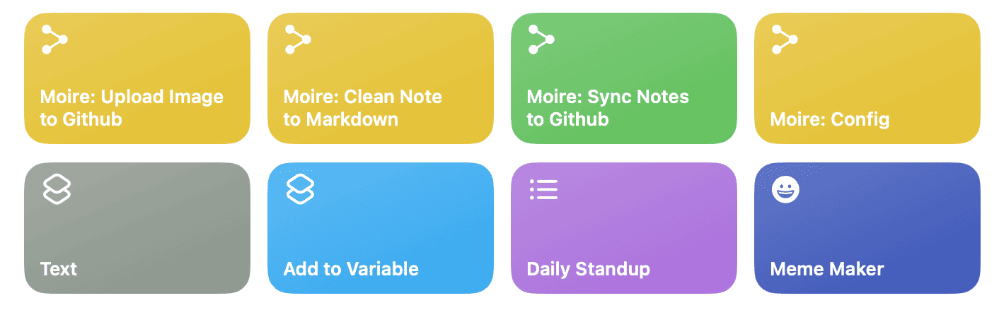

##   
  
  
##   
  
  
##   
  
  
##   
  
  
##   
  
  
##   
  
  
##   
  
  
## p.p1 {margin: 0.0px 0.0px 0.0px 0.0px; font: 20.0px 'Helvetica Neue'}  
  
## p.p2 {margin: 0.0px 0.0px 0.0px 0.0px; font: 20.0px 'PingFang SC'}  
  
## p.p3 {margin: 0.0px 0.0px 0.0px 0.0px; font: 13.0px 'Helvetica Neue'; min-height: 16.0px}  
  
## p.p4 {margin: 0.0px 0.0px 0.0px 0.0px; font: 13.0px 'PingFang SC'}  
  
## p.p5 {margin: 0.0px 0.0px 2.0px 0.0px; font: 16.0px 'Helvetica Neue'; min-height: 18.0px}  
  
## p.p6 {margin: 0.0px 0.0px 2.0px 0.0px; font: 16.0px 'Helvetica Neue'}  
  
## p.p7 {margin: 0.0px 0.0px 0.0px 0.0px; font: 13.0px 'Helvetica Neue'}  
  
## p.p8 {margin: 8.0px 0.0px 8.0px 0.0px; font: 13.0px 'Helvetica Neue'}  
  
## p.p9 {margin: 0.0px 0.0px 0.0px 0.0px; font: 13.0px 'PingFang SC Semibold'}  
  
## li.li7 {margin: 0.0px 0.0px 0.0px 0.0px; font: 13.0px 'Helvetica Neue'}  
  
## span.s1 {font: 20.0px 'Helvetica Neue'}  
  
## span.s2 {font: 13.0px 'Helvetica Neue'}  
  
## span.s3 {font: 13.0px 'PingFang SC'}  
  
## span.s4 {text-decoration: line-through}  
  
## span.s5 {font: 13.0px 'Helvetica Neue'; text-decoration: line-through}  
  
## span.s6 {font: 16.0px 'PingFang SC'}  
  
## span.s7 {font: 9.0px Menlo}  
  
## table.t1 {border-collapse: collapse}  
  
## td.td1 {border-style: solid; border-width: 1.0px 1.0px 1.0px 1.0px; border-color: #9a9a9a #9a9a9a #9a9a9a #9a9a9a; padding: 1.0px 5.0px 1.0px 5.0px}  
  
## ol.ol1 {list-style-type: decimal}  
  
## ul.ul1 {list-style-type: disc}  
  
##   
  
  
##   
  
  
##   
  
  
## Markdown 语法支持  
  
## 这是   一个大标题   
  
##   
  
  
##   
  
  
## 你可以使用 粗体 或 italic 也可以使用 链接 或者 删除线   
  
##   
  
  
##   
  
  
## 这是一个 test 标题  
  
##   
  
  
##   
  
  
## 配好了快捷键  
  
##   
  
  
##   
  
  
## 配好了ios的快捷键  
  
##   
  
  
##   
  
  
## 你无法保持原生的引用样式，但你可以  
  
##   
  
  
##   
  
  
## > 用 markdown 引用语法来实现引用  
  
##   
  
  
##   
  
  
## 你也可以使用：  
  
##   
  
  
##   
  
  
##   
  
  
## Bulleted List 1  
  
## Bulleted List 2  
  
##   
  
  
##   
  
  
##   
  
  
## 或者  
  
##   
  
  
##   
  
  
##   
  
  
## Numbered list  
  
## Numbered list  
  
##   
  
  
##   
  
  
##   
  
  
##   
  
  
##   
  
  
##   
  
  
## 你还可以画一个表格：  
  
##   
  
  
##   
  
  
##   
  
  
## | 名称 | 重力 | 位次 |  
  
## |---|---|---|  
  
## | 水星 | 3.7 | 第一 |  
  
## | 金星 | 8.9 | 第二 |  
  
##   
  
  
##   
  
  
##   
  
  
##   
  
  
## #测试 #markdown #语法  
  
##   
  
  
##   
  
  
##   
  
  
##   
  
  
##   
  
  
##   
  
  

