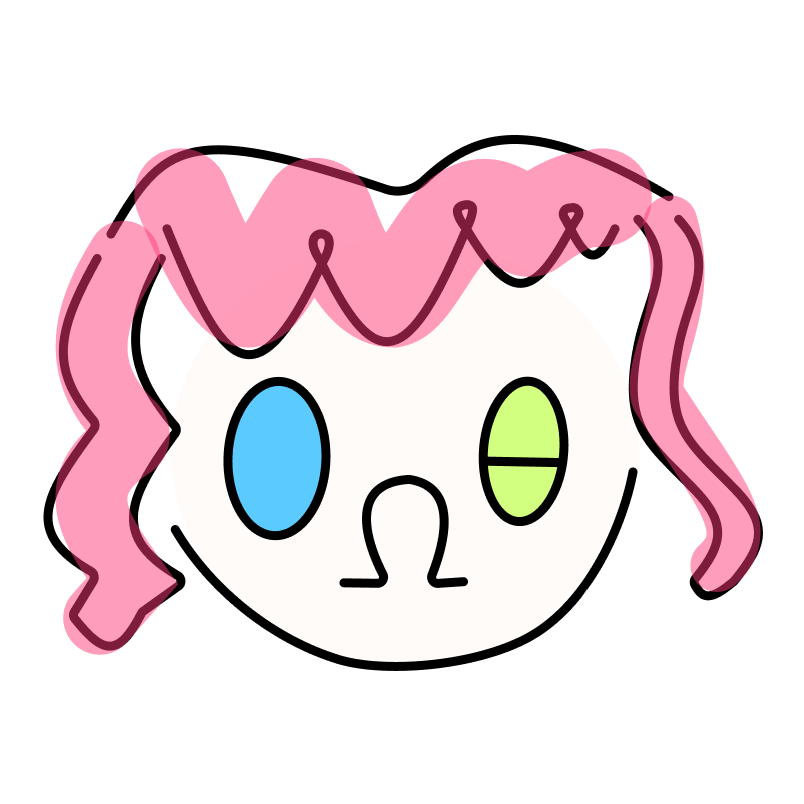

## **关于设计个人 icon**  

这周考完 midterm 在那翻以前的草稿本，发现了一组随意涂涂写写的符号，核心是 O Ω θ 三个数学符号。那会儿应该正在上算法课，这组符号是用来衡量算法的时间复杂度的，在草稿上写着写着它就变成了一张脸，我加上卷头发和圆下巴，感觉还挺可爱！

打算把它拿来作为我个人的 icon，之前画像素画一直在纠结的找不到的东西突然就这样出现在了我的眼前！真是奇妙 : D

