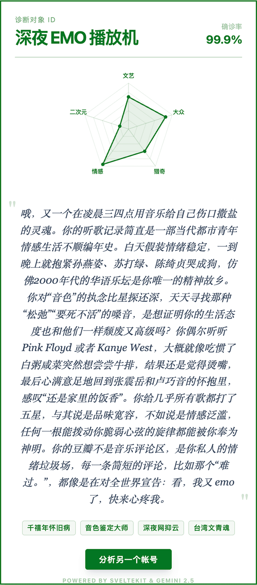

## ROAST MY DOUBAN  

又搞了个好玩的

**1\. ****pretentiousness**** (装 X 值 / 逼格)**

  * **含义：** 看了多少晦涩难懂、高分冷门、哲学、纪录片、古典乐、实验电影。
  * **高分表现：** 塔尔科夫斯基、《尤利西斯》、古尔德。
  * **低分表现：** 漫威、爽文、抖音神曲。
  * **Roast 点：** 分高骂他装，分低骂他俗。

**2\. ****mainstream**** (从众度 / 现充值)**

  * **含义：** 与当下流行趋势的重合度。是不是只看 Top 250？是不是什么火看什么？
  * **高分表现：** 贾玲、《三体》、周杰伦、霉霉。
  * **低分表现：** 只有几百人标记的冷门B级片、地下乐队。
  * **Roast 点：** 分高骂他没主见（跟风狗），分低骂他性格孤僻（反社会）。

**3\. ****nostalgia**** (怀旧值 / 遗老度)**

  * **含义：** 内容的时间跨度。
  * **高分表现：** 喜爱黑白片、80/90年代港片、经典文学、老摇滚。
  * **低分表现：** 追新番、追当季美剧、看网络小说。
  * **Roast 点：** 分高骂他活在过去（僵尸），分低骂他快餐文化（没底蕴）。

**4\. ****darkness**** (致郁度 / 阴暗值)**

  * **含义：** 内容的情绪色彩。包括恐怖、惊悚、悲剧、致郁系、重金属、犯罪。
  * **高分表现：** 《熔炉》、伊藤润二、太宰治、后摇。
  * **低分表现：** 喜剧、合家欢、励志书、正能量。
  * **Roast 点：** 分高骂他心理变态（建议就医），分低骂他傻白甜（没挨过毒打）。

**5\. ****geekiness**** (死宅值 / 浓度)**

  * **含义：** 替代原来的 acg，但范围更广。包含科幻、奇幻、动漫、游戏改编、硬核推理。
  * **高分表现：** 赛博朋克、高达、魔戒、克苏鲁、硬科幻。
  * **低分表现：** 现实主义题材、生活剧、职场书。
  * **Roast 点：** 分高骂他逃避现实（中二病），分低骂他缺乏想象力（无聊的大人）。

