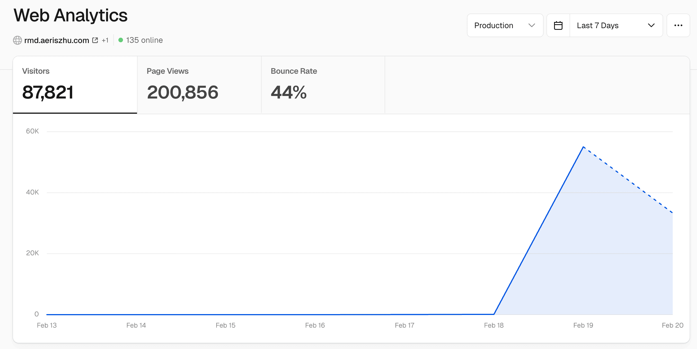

## **时也运也**  

之前我认真做的很多项目有趣或有用，但也只在小范围内被夸被传播。这次 vibe 一个下午的项目彻底爆了，火了。甚至 vercel 的那二十刀马上就要用完不得不迁移到 cloudflare。其实我在 po 出去之前大概知道会收到比以前多的热度，但没想到了这样一个程度。

我的感受是，人类真的很孤独，因为没有（或者极少的）人会盯着你的电影/图书标记去逐字逐句剖析你，所以即使是这样一个 mean, cynical 和 sharp 的 AI 锐评，用着一种模糊的语言，高端一点的巴甫洛夫效应，可能碰运气某一句话击中了你，也还是会被大家热烈地分享/传播。

当然，也收到了一大堆用户说我盗取用户数据，说它爹味重，说我借着AI一顿骂还有脸要钱，甚至把我性别都对掉了说我是 bro。就感觉自己火了，人红是非多。这些用户当务之急是分清 ID 和网名的区别，多读几本书多看新闻跟上时代，了解一下这个世界的运行规律和常识。哦不对，他们连 API Key 都不知道是什么东西吧？

