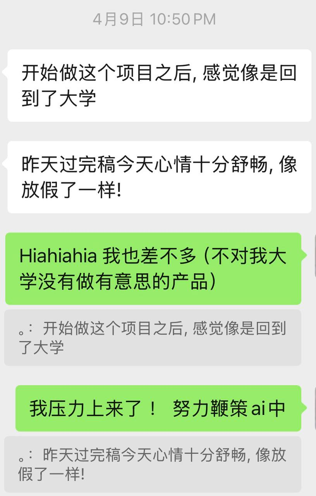

## **最近好像有点幸运**  

上个月开始在间歇性 Vibe 一个 iOS App，之前一直忍受着长达二十几秒的 build，今天改样式比较多终于无法忍受了开始寻找一些法子，用上了 AI 告诉我的 injection ，现在简单改动可以在三秒内刷新了。虽然和前端的 hot reload 体验还差得很远 ….. 但已经是极大的提升。今天早上开会，朋友告诉我她为了提升可读性在设计稿里也用到了一些新学的东西比如 Autolayout 嘿嘿。

整体感觉就是太幸福了最近都全情投入在自己喜欢的事情里，不管是上班准备做的事情（mentor跟我的说法让我觉得有好多可以自由发挥的地方），还是正在做的个人项目。另外芝加哥春天到了天气真是太好啦，这周日要去南边的一个博物馆玩，期待住了。

虽然但是，现在每天忙得没时间看电视剧和出去玩，接下来打算的常规日程是这样，周日～周三上班，周四个人项目，周五周六（让 AI 帮我）写写作业+放松。关于未来不要担忧太多，一点一点慢慢来 ‘◡’

